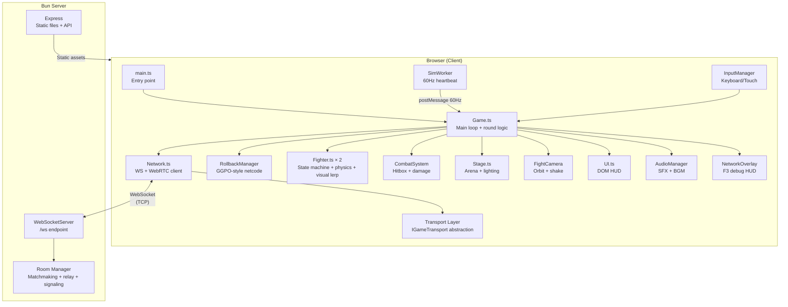
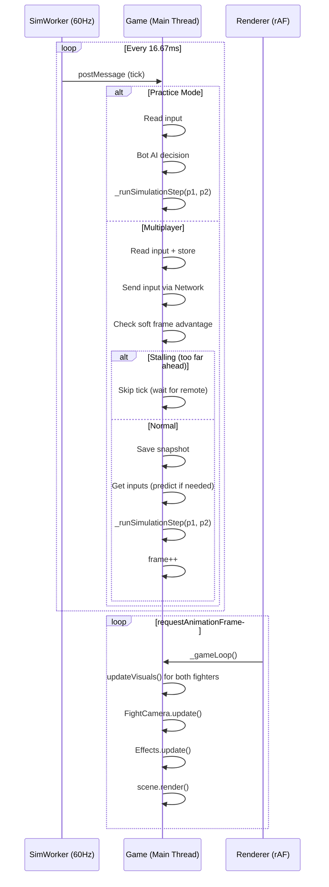
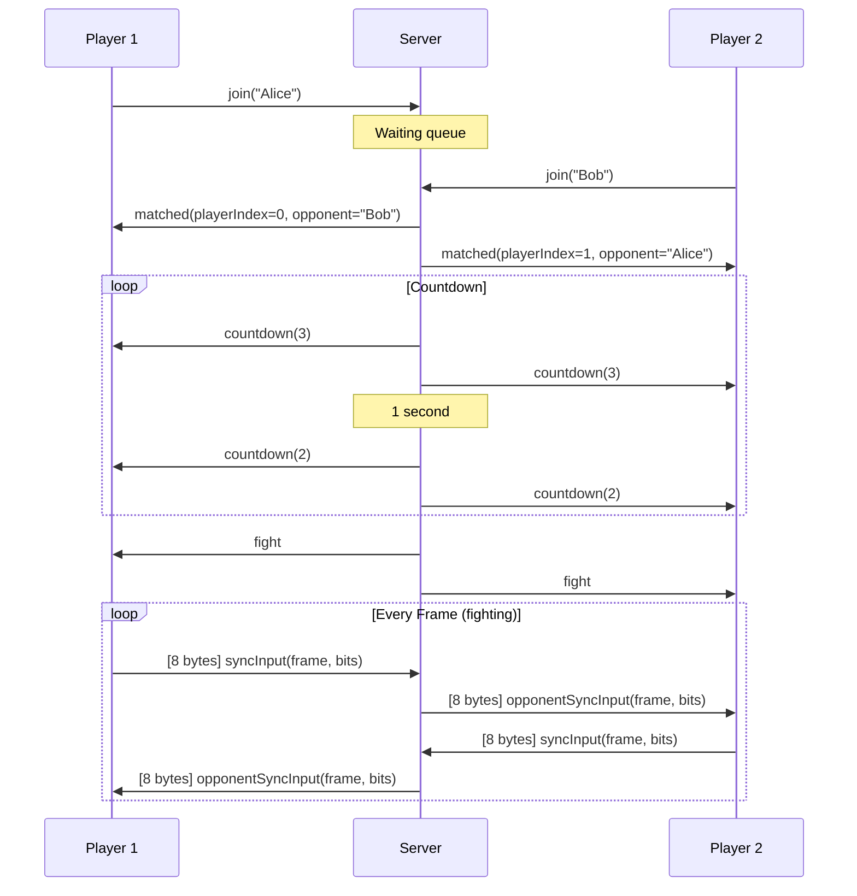
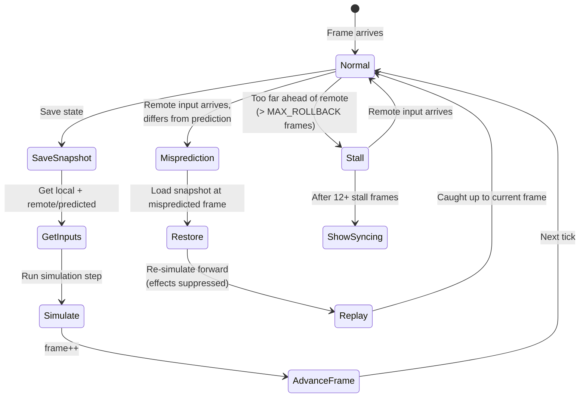
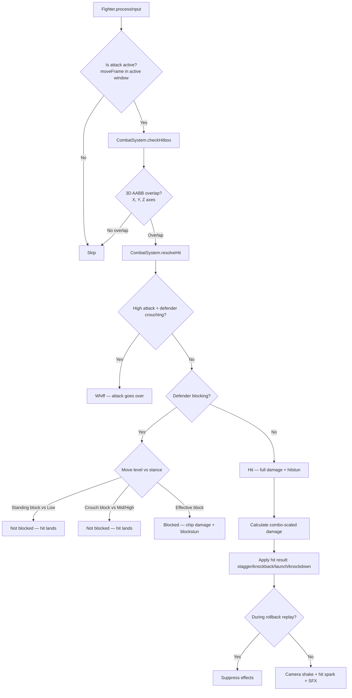
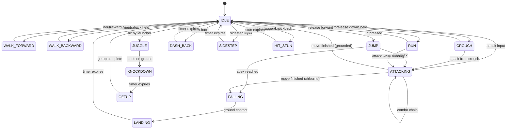
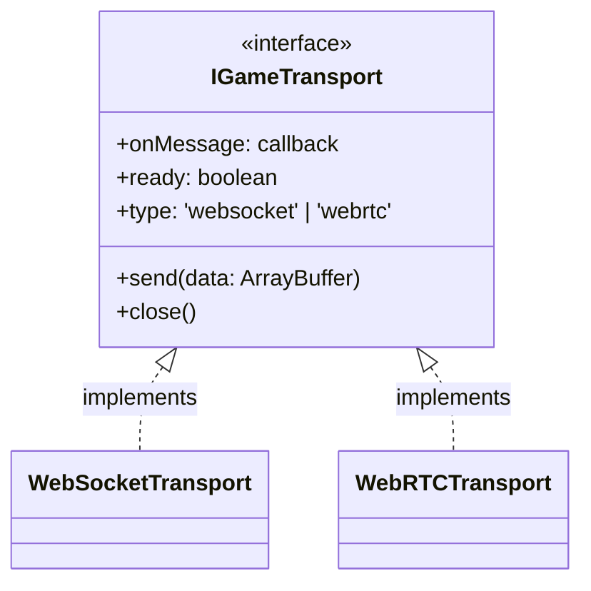

# H4KKEN — Architecture Analysis

> **Purpose**: Document the current system architecture for contributors. All diagrams are Mermaid-compatible for GitHub rendering.

## Table of Contents

1. [High-Level Architecture](#1-high-level-architecture)
2. [Game Loop & Tick Model](#2-game-loop--tick-model)
3. [Network Protocol](#3-network-protocol)
4. [Rollback Netcode (GGPO-Style)](#4-rollback-netcode-ggpo-style)
5. [Combat Resolution Pipeline](#5-combat-resolution-pipeline)
6. [Fighter State Machine](#6-fighter-state-machine)
7. [Rendering Stack](#7-rendering-stack)
8. [WebRTC Transport Layer](#8-webrtc-transport-layer)
9. [Input Delay & Hit Stop](#9-input-delay--hit-stop)
10. [Network Debug Overlay](#10-network-debug-overlay)
11. [Test Harness](#11-test-harness)

---

## 1. High-Level Architecture



### Module Dependency Map

| Module | Depends On | Depended By |
|--------|-----------|-------------|
| `Game.ts` | Everything | `main.ts`, `NetworkEvents.ts` |
| `Network.ts` | `InputCodec`, `Transport`, `WebRTCTransport`, `animations` (types) | `Game.ts`, `NetworkEvents.ts` |
| `RollbackManager.ts` | `Fighter` (types), `Input` (types) | `Game.ts` |
| `Fighter.ts` | `CombatSystem`, `constants`, `animations`, `FighterStateHandlers` | `Game.ts`, `RollbackManager` |
| `CombatSystem.ts` | `moves`, `types`, `constants` | `Game.ts`, `Fighter.ts` |
| `InputCodec.ts` | `Input` (types) | `Network.ts` |
| `Transport.ts` | — | `Network.ts`, `WebRTCTransport.ts` |
| `WebRTCTransport.ts` | `Transport` (interface) | `Network.ts` |
| `NetworkOverlay.ts` | `RollbackManager` (types), `Network` (types) | `Game.ts` |
| `EffectsManager.ts` | Babylon.js | `Game.ts` |

---

## 2. Game Loop & Tick Model

The game uses a **split architecture**: rendering runs on `requestAnimationFrame` (pauses when tab hidden), while simulation runs on a **Web Worker heartbeat** at a fixed 60Hz (continues when tab hidden).



### Why Web Worker for Simulation?

`requestAnimationFrame` throttles to ~1fps when the browser tab loses focus. Without the worker, a player who alt-tabs would stop sending inputs, causing their opponent to stall. The worker ensures the game keeps ticking regardless of tab visibility.

---

## 3. Network Protocol

### Transport: Dual WebSocket + WebRTC DataChannel

- **WebSocket (TCP)**: Always-on for JSON messages (matchmaking, round results, signaling). `TCP_NODELAY` enabled server-side.
- **WebRTC DataChannel (UDP)**: Preferred for binary game inputs. `ordered: false, maxRetransmits: 0`. Falls back to WS if handshake fails.
- Protocol auto-detection: `wss://` on HTTPS, `ws://` on HTTP
- Binary mode: `ws.binaryType = 'arraybuffer'`
- Signaling (SDP/ICE) relayed over existing WebSocket — no extra infrastructure beyond optional TURN server

### Message Types

| Direction | Type | Format | Size | Purpose |
|-----------|------|--------|------|---------|
| C→S | `syncInput` | **Binary** | 8 bytes | Per-frame input (fast-path) |
| S→C | `opponentSyncInput` | **Binary** | 8 bytes | Relayed opponent input |
| C→S | `join` | JSON | ~50B | Find match |
| S→C | `matched` | JSON | ~80B | Match found + player index |
| S→C | `countdown` | JSON | ~30B | 3→2→1→FIGHT |
| S→C | `fight` | JSON | ~20B | Start fighting |
| C→S/S→C | `roundResult` | JSON | ~100B | KO/timeout result sync |
| C→S | `ping` / S→C `pong` | JSON | ~30B | RTT measurement (every 2s) |

### Binary Input Encoding (8 bytes)

```
Byte 0:     Opcode (0x01 = syncInput, 0x02 = opponentSyncInput)
Bytes 1-3:  Frame number (uint24 big-endian, supports 16M+ frames)
Bytes 4-7:  Input bitmask (uint32 big-endian, 22 of 32 bits used)
```

**Input bitmask layout** (22 bits):
- Bits 0-8: Held buttons (up, down, left, right, block, lp, rp, lk, rk)
- Bits 9-21: One-frame triggers (just-pressed variants, dashes, sidesteps, super)

**Bandwidth**: 8 bytes × 60fps = **480 bytes/sec** per player. Negligible.

### Server Role: Relay + Orchestrator

The server does **not** run game simulation. It:
1. Matches players (FIFO queue)
2. Relays binary inputs (zero-copy: flip opcode byte, forward)
3. Manages room state machine (countdown → fighting → roundEnd → matchEnd)
4. Syncs round results (waits for both clients, 2s timeout)



---

## 4. Rollback Netcode (GGPO-Style)

### Core Concept

Both clients run simulation locally with **prediction** for the remote player. When the actual remote input arrives and differs from prediction, the game **rewinds** to the mispredicted frame and **replays** forward with corrected inputs. Visual/audio side effects are suppressed during replay.



### Key Parameters

| Parameter | Value | Rationale |
|-----------|-------|-----------|
| `MAX_ROLLBACK` | 30 frames (500ms) | Handles VPN/high-latency (avg ~17f) with headroom |
| Soft frame advantage | 3-8 frames (dynamic) | `ceil(RTT/16.67) + 2`, clamped. Low-latency = shallow rollback |
| Stall UI threshold | 12 frames (~200ms) | Prevents flicker from brief jitter |
| Prediction strategy | Hold last confirmed buttons | Strip one-frame triggers (attacks unlikely to repeat) |
| Snapshot pruning | Every 60 frames, discard > 120 frames old | Memory management |

### Rollback Depth vs RTT

| Connection | RTT | Soft Advance | Typical Rollback Depth |
|-----------|-----|-------------|----------------------|
| LAN | 1-5ms | 3 frames | 0-1 frames |
| Same region | 20-40ms | 4-5 frames | 1-3 frames |
| Cross-continent | 120-200ms | 8 frames | 5-12 frames |
| VPN/bad connection | 200-350ms | 8 frames (capped) | 12-20 frames |

### Diagnostics (logged every 5s)

- `fps`: Render frames per second
- `rtt`: WebSocket round-trip time
- `remoteLag`: Average frames behind remote input arrives
- `stalls`: Frames where simulation paused waiting for remote
- `rollbacks`: Number of state rewinds
- `rollbackDepth`: Average frames replayed per rollback
- `mispredPct`: Percentage of predictions that were wrong

---

## 5. Combat Resolution Pipeline



### Hitbox System: 3D AABB

Hitboxes are defined per-move with offset and size relative to the attacker's facing angle:

```
World hitbox position:
  hbx = attackerPos.x + forwardOffset × cos(facingAngle) - lateralOffset × sin(facingAngle)
  hby = attackerPos.y + verticalOffset
  hbz = attackerPos.z + forwardOffset × sin(facingAngle) + lateralOffset × cos(facingAngle)

Defender bounding box (hardcoded):
  Width: 0.5, Height: 1.8, Depth: 0.4
```

### Frame Data Structure

Every move has 3 phases:
```
|-- Startup --|-- Active --|-- Recovery --|
   (can't hit)   (hitbox on)   (can't act)
```

Example — Left Punch (lp): 10f startup + 3f active + 11f recovery = 24 total frames (0.4s)

---

## 6. Fighter State Machine



### 27 Total States

Movement: `IDLE`, `WALK_FORWARD`, `WALK_BACKWARD`, `CROUCH`, `CROUCH_WALK`, `JUMP`, `JUMP_FORWARD`, `JUMP_BACKWARD`, `FALLING`, `RUN`, `SIDESTEP`, `DASH_BACK`, `LANDING`

Combat: `ATTACKING`

Hit reaction: `HIT_STUN`, `BLOCK_STUN`, `JUGGLE`, `KNOCKDOWN`, `GETUP`

Terminal: `VICTORY`, `DEFEAT`

---

## 7. Rendering Stack

| Component | Technology | Notes |
|-----------|-----------|-------|
| **Engine** | Babylon.js 8 (WebGPU preferred, WebGL fallback) | Left-handed Y-up coordinate system |
| **Lighting** | HemisphericLight + DirectionalLight | Specular disabled, shadow generator |
| **Shadows** | ShadowGenerator (PCF) | 2048px desktop / 1024px mobile |
| **Post-Processing** | DefaultRenderingPipeline | Bloom (desktop only), ACES tone mapping |
| **Quality Monitor** | SceneOptimizer | Targets 40fps, progressive degradation |
| **Characters** | GLB (Quaternius UAL, CC0) | 65-bone skeleton, 67 animation clips |
| **Particles** | Babylon ParticleSystem | Hit sparks (object pooled), super aura |
| **Arena** | Procedural geometry | Frozen world matrices + materials |

### Performance Optimizations Already Present

- `scene.skipPointerMovePicking = true` — No raycasting on mouse move
- `scene.autoClear = false` — Sky sphere covers all pixels
- `scene.blockMaterialDirtyMechanism = true` during rollback replay — avoids 144+ unnecessary material dirty checks per rollback
- All stage meshes: `freezeWorldMatrix()` + `material.freeze()` + `doNotSyncBoundingInfo`
- Mobile: bloom disabled from frame 1, hardware scaling at `dpr/2`
- SceneOptimizer progressive degradation: PostProcess → Shadows → Particles → HardwareScaling
- iOS WebGPU skipped (known Babylon.js issues)
- **GPU bone matrices**: `skeleton.useTextureToStoreBoneMatrices = true` — ~10-15% animation performance on 65-bone skeletons
- **Pre-warmed spark pool**: 24 meshes allocated at load time — zero GC allocation during first hits
- **Object-pooled particles**: sparks return to pool when expired, recycled next hit

---

## 8. WebRTC Transport Layer

Binary game inputs can use WebRTC DataChannel for UDP-like delivery, eliminating TCP head-of-line blocking.

### Transport Abstraction



### Lifecycle

1. Match starts on WebSocket immediately (zero delay)
2. `playerIndex === 0` creates SDP offer → signaled via WS
3. Opponent answers → ICE candidates exchanged
4. DataChannel opens → binary input path switches to WebRTC
5. If handshake fails within 5s → stays on WS, no player impact
6. If DataChannel drops mid-match → falls back to WS seamlessly

### Files

| File | Purpose |
|------|---------|
| `src/transport/Transport.ts` | `IGameTransport` interface + `WebSocketTransport` |
| `src/transport/WebRTCTransport.ts` | Full `RTCPeerConnection` + DataChannel lifecycle |
| `src/Network.ts` | Signaling relay methods, transport switching |
| `server.ts` | `handleSignalingRelay()` — pure relay of SDP/ICE |

---

## 9. Input Delay & Hit Stop

### Configurable Input Delay

Local input is scheduled `N` frames into the future to reduce rollback depth on high-latency links.

| RTT | Input Delay | Effect |
|-----|-------------|--------|
| < 30ms (LAN) | 0 frames | Instant feel, no added latency |
| 30-80ms (broadband) | 1 frame | Shallower rollback by ~1 frame |
| > 80ms (intercontinental) | 2 frames | Shallower rollback by ~2 frames |

Auto-computed from RTT at match start. Implementation: `Game.ts` `_inputDelayFrames`.

### Visual Hit Stop

Freezes fighter visual positions for a few render frames on hit/block impact.

- **Light attack**: 3 frames (~50ms)
- **Heavy attack**: 5 frames (~83ms)
- **Render-only**: sim continues ticking normally — determinism preserved
- Camera, effects, and overlay still update during freeze

Purpose: gives the player's brain time to register the impact, especially helpful when rollback corrections coincide with a hit.

---

## 10. Network Debug Overlay

Toggle with **F3** during gameplay. Shows real-time network metrics.

| Metric | Source | Example |
|--------|--------|---------|
| RTT | `Network.rtt` | `180ms` |
| Transport | Transport type | `WS` / `WEBRTC` |
| Soft Advance | Computed from RTT | `6f` |
| Frame | Current sim frame | `4521` |
| Input Delay | `Game.inputDelayFrames` | `2f` |
| Rollbacks | `RollbackManager.diag` | `3 (avg 4.2f)` |
| Misprediction % | `RollbackManager.diag` | `12%` |
| Remote Lag | `RollbackManager.diag` | `avg 5.1f` |
| Stalls | `RollbackManager.diag` | `0f` |

Implementation: `src/debug/NetworkOverlay.ts`

---

## 11. Test Harness

Headless network simulation in `tests/net-sim/` — runs without browser, DOM, or Babylon.js.

### Components

| File | Purpose |
|------|---------|
| `NetSimulator.ts` | Simulates latency, jitter, packet loss between two virtual clients |
| `HeadlessGame.ts` | Minimal sim loop using RollbackManager — validates determinism |
| `scenarios.ts` | 4 input scripts: aggressive, defensive, erratic, idle |
| `run-sim.ts` | Runner with 4 network profiles (LAN, broadband, MX↔DE, worst-case VPN) |

### Run

```bash
bun run tests/net-sim/run-sim.ts
```

Outputs per-scenario rollback stats, misprediction rates, and stall counts per network profile.
