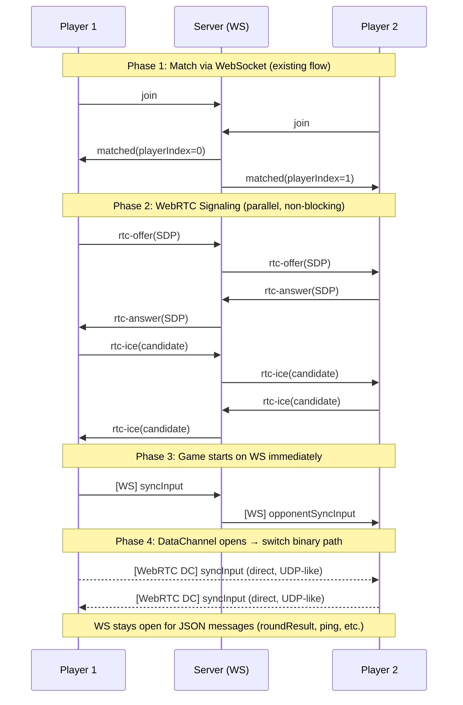
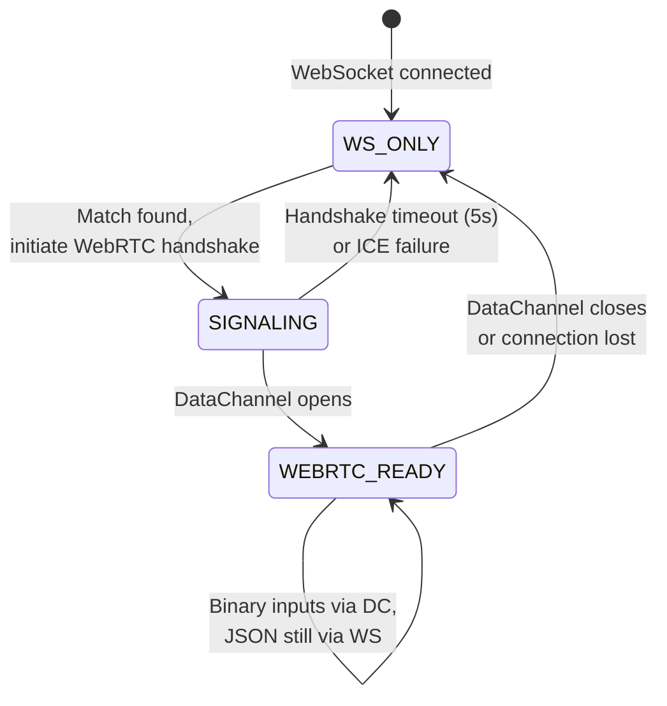
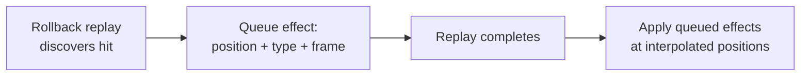
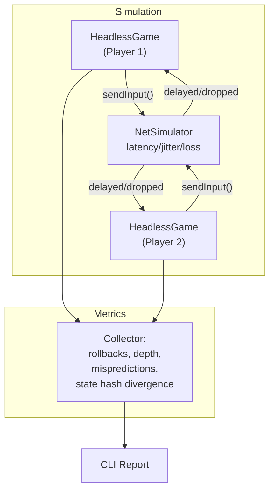

# H4KKEN — Improvements

> **Purpose**: Document each improvement with problem statement, solution, expected impact, and implementation status. All diagrams are Mermaid-compatible.

## Status Summary

| # | Improvement | Status | Files |
|---|------------|--------|-------|
| 1 | WebRTC DataChannel Transport (UDP) | ✅ Implemented | `src/transport/`, `src/Network.ts`, `server.ts` |
| 2 | Remote Fighter Visual Interpolation | ✅ Implemented | `src/fighter/Fighter.ts` |
| 3 | Hit Effect Queueing During Rollback | ✅ Implemented | `src/game/Game.ts` |
| 4 | Network Debug Overlay | ✅ Implemented | `src/debug/NetworkOverlay.ts` |
| 5 | Network Simulation Test Harness | ✅ Implemented | `tests/net-sim/` |
| 6 | Rendering Optimizations | ✅ Implemented | `src/fighter/Fighter.ts`, `src/game/EffectsManager.ts`, `src/game/Game.ts` |
| 7 | Configurable Input Delay | ✅ Implemented | `src/game/Game.ts` |
| 8 | Visual Hit Stop | ✅ Implemented | `src/game/Game.ts` |

## Table of Contents

1. [WebRTC DataChannel Transport (UDP)](#1-webrtc-datachannel-transport-udp)
2. [Remote Fighter Visual Interpolation](#2-remote-fighter-visual-interpolation)
3. [Hit Effect Queueing During Rollback](#3-hit-effect-queueing-during-rollback)
4. [Network Debug Overlay](#4-network-debug-overlay)
5. [Network Simulation Test Harness](#5-network-simulation-test-harness)
6. [Rendering Optimizations](#6-rendering-optimizations)
7. [Configurable Input Delay](#7-configurable-input-delay)
8. [Visual Hit Stop](#8-visual-hit-stop)

---

## 1. WebRTC DataChannel Transport (UDP)

### Problem

The current WebSocket transport uses TCP, which guarantees ordered delivery. When a packet is lost on a transatlantic connection (Mexico ↔ Germany, ~1-2% loss rate), TCP retransmits it and **blocks all subsequent packets** until the lost one arrives. This is called **head-of-line blocking** and can cause 300-500ms spikes on a single lost packet — devastating for a fighting game.

```
TCP timeline (packet loss at frame 100):
Frame 99:  ──→ arrives (5ms)
Frame 100: ──→ LOST → retransmit → arrives (180ms later!)
Frame 101: ──→ buffered (waiting for 100) → delivered with 100
Frame 102: ──→ buffered → delivered with 100
                          ↑ All three frames delayed by one loss
```

### Solution

Add WebRTC DataChannel as preferred transport with WebSocket fallback. DataChannels support **unreliable, unordered** mode (`ordered: false, maxRetransmits: 0`) which gives UDP-like semantics: lost packets are simply skipped.

```
WebRTC UDP timeline (packet loss at frame 100):
Frame 99:  ──→ arrives (5ms)
Frame 100: ──→ LOST (never retransmitted)
Frame 101: ──→ arrives (5ms) — NOT blocked by frame 100
Frame 102: ──→ arrives (5ms)
                          ↑ Only frame 100 is predicted (rollback handles it)
```

### Architecture



### Transport State Machine



### Expected Impact

| Metric | Before (WS/TCP) | After (WebRTC/UDP) | Improvement |
|--------|-----------------|-------------------|-------------|
| Base RTT | ~180ms | ~170ms (no TCP overhead) | ~6% |
| RTT during 1% loss | 300-500ms spikes | ~180ms stable | **60-70%** |
| Rollback depth (avg) | 8-12 frames | 5-8 frames | **30-40%** |
| Visible teleports | Frequent under loss | Rare | Perceived smoothness |

### Key Design Decisions

- **Dual transport**: WebRTC preferred, WS fallback. No breaking change.
- **Signaling via existing WS**: No new infrastructure needed beyond TURN server.
- **Game starts on WS**: Zero-delay start, WebRTC upgrades in background.
- **Same 8-byte protocol**: `InputCodec` binary format reused on both transports.
- **JSON stays on WS**: Only binary game inputs use DataChannel. Round results, ping, etc. remain on WS for reliability.

---

## 2. Remote Fighter Visual Interpolation

### Problem

When rollback corrects the remote fighter's position (e.g., 3 frames of misprediction at walk speed = ~0.135 units), the visual mesh **teleports** instantly. This creates a perception that hits connect from impossibly far away, because the player sees:

1. Opponent at position A (predicted)
2. Rollback corrects to position B (0.135 units closer)
3. Hit registers at position B
4. Visually: opponent "jumps" forward and hit spark appears at new position

### Solution

Apply **visual interpolation** (lerp) to the remote fighter's rendered position only:

```
simPosition:    [frame N] ────────→ [frame N+1]  (instant, deterministic)
visualPosition: [frame N] ~~smooth~~→ [frame N+1] (lerp factor 0.4, 2-3 frame convergence)
```

- **Local fighter**: instant position update (player expects immediate response to their input)
- **Remote fighter**: smoothed with `lerp(visualPos, simPos, 0.4)` during online play
- **Practice mode**: both instant (no network, no rollback)

### Expected Impact

- Rollback corrections become **invisible** for corrections ≤ 3 frames
- Hits appear to connect at the correct distance rather than after a teleport
- No impact on simulation determinism (only visual layer changes)

---

## 3. Hit Effect Queueing During Rollback

### Problem

During rollback replay (`_isReplaying = true`), hit effects (camera shake, sparks, SFX) are suppressed. But if replay discovers a **new hit** that wasn't predicted, the effect appears only after replay completes — at the post-correction position, which may differ from where the player "saw" the attack.

### Solution

Queue hit effects discovered during replay. After replay completes, apply them at **interpolated positions** between pre-correction and post-correction fighter locations.



---

## 4. Network Debug Overlay

### Problem

Developers and testers need real-time visibility into network quality to diagnose issues and validate improvements. Currently, diagnostics are only logged to console every 5 seconds.

### Solution

Optional HUD overlay (toggled via F3) showing real-time network metrics in a compact, non-intrusive position corner overlay.

### Metrics Displayed

| Metric | Source | Format |
|--------|--------|--------|
| RTT | `network.rtt` | `180ms` |
| Transport | Transport type | `WS` or `WebRTC` |
| Rollbacks | `RollbackManager.diag` | `3 (avg 4.2f)` |
| Misprediction | `RollbackManager.diag` | `12%` |
| Stall frames | `RollbackManager.diag` | `0f` |
| Soft advance | Computed from RTT | `6f` |
| Remote delay | `RollbackManager.diag` | `avg 5.1f` |

---

## 5. Network Simulation Test Harness

### Problem

Testing network improvements requires two players on separate connections. There's no way to programmatically simulate different network conditions (latency, jitter, packet loss) to measure improvements objectively.

### Solution

Headless network simulation framework in `tests/net-sim/`:



### Network Presets

| Preset | One-way Latency | Jitter | Packet Loss |
|--------|----------------|--------|-------------|
| `LAN` | 1ms | 0ms | 0% |
| `SameContinent` | 30ms | 5ms | 0.5% |
| `Intercontinental` | 120ms | 15ms | 1.5% |
| `BadWifi` | 80ms | 25ms | 5% |

### Test Scenarios

| Scenario | Description | Expected Baseline |
|----------|-------------|-------------------|
| `idle` | Both players stand still | 0 rollbacks, 0 divergence |
| `rushdown` | P1 attacks aggressively, P2 blocks | Moderate rollbacks |
| `simultaneous` | Both attack same frame | Worst case for prediction |
| `spike` | 500ms latency spike at frame 300 | Tests stall/recovery |

---

## 6. Rendering Optimizations

### Already Excellent

The existing codebase has strong rendering optimizations:
- Frozen world matrices on all static geometry
- Object-pooled particle effects
- SceneOptimizer with progressive degradation
- Mobile-specific hardware scaling and bloom disable
- `autoClear = false` (sky covers all pixels)
- `skipPointerMovePicking = true`

### Implemented Optimizations

| Optimization | Impact | Status | Notes |
|-------------|--------|--------|-------|
| **GPU bone matrices** | ~10-15% animation perf | ✅ Implemented | `skeleton.useTextureToStoreBoneMatrices = true` in Fighter.ts |
| **Pre-warm effect pool** | Eliminate first-hit stutter | ✅ Implemented | 24 spark meshes pre-allocated in EffectsManager constructor |
| **Block material dirty during replay** | ~0.3ms saved per rollback | ✅ Implemented | `scene.blockMaterialDirtyMechanism = true` during setReplaying() |

### Future Considerations

| Optimization | Impact | Complexity | Notes |
|-------------|--------|-----------|-------|
| **KTX2 texture compression** | ~60% VRAM savings on GLBs | Medium | GPU-decompressed, Babylon supports natively. Requires converting all GLB textures to KTX2 format. |
| **Animation LOD** | Less blending for distant camera | Low | Reduce blend speed when camera far. Low priority — camera stays close in a fighting game. |

---

## 7. Configurable Input Delay

### Problem

On intercontinental connections (Mexico ↔ Germany, ~180ms RTT), the opponent's input arrives ~11 frames late. Without input delay, every frame requires prediction and frequent rollbacks (avg depth 5-8 frames). Deeper rollback = more replay computation and more visible correction artifacts.

### Solution

Schedule local input `N` frames into the future. The player's own input takes effect with a small delay (1-2 frames = 16-33ms, imperceptible to most players), but remote inputs have more time to arrive — reducing rollback depth proportionally.

| RTT | Input Delay | Rollback Depth Reduction |
|-----|-------------|-------------------------|
| < 30ms (LAN) | 0 frames | None needed — already shallow |
| 30-80ms (broadband) | 1 frame (~17ms) | ~1 frame shallower |
| > 80ms (intercontinental) | 2 frames (~33ms) | ~2 frames shallower |

### Implementation

- `Game.ts`: `_inputDelayFrames` field, auto-set from RTT at match start
- `_advanceWithRollback()`: stores input at `frame + delay` instead of `frame`
- `NetworkOverlay.ts`: displays current input delay in the F3 overlay
- Reset on match end

**Reference**: [AOE] "Commands scheduled 2 turns ahead" — same concept adapted from lockstep to rollback.

---

## 8. Visual Hit Stop

### Problem

When a hit connects during a rollback correction, the fighter positions may shift by several pixels in a single frame. The player sees the hit flash but the positions "jump" — the brain doesn't have time to process where the hit actually landed.

### Solution

Freeze fighter visual positions for a few render frames on impact. The simulation continues advancing normally (determinism preserved).

- **Light attacks** (≤12 damage): 3 render frames (~50ms)
- **Heavy attacks** (>12 damage): 5 render frames (~83ms)
- Camera, stage, effects, and overlay still update during freeze — only fighter meshes hold position
- Overlapping hits use `Math.max()` so concurrent hits don't shorten the freeze

### Why Render-Only?

The hit stop MUST NOT affect the simulation step — both clients must advance the same number of sim frames per tick regardless of rendering. Only the visual presentation layer pauses.

**Reference**: Standard technique in modern fighting games (SFV, Guilty Gear Strive). Validated by [OSAKA] Ishioka's research on visual feedback timing.
