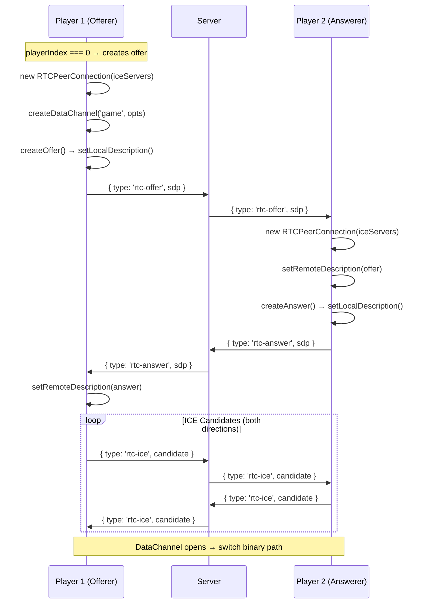
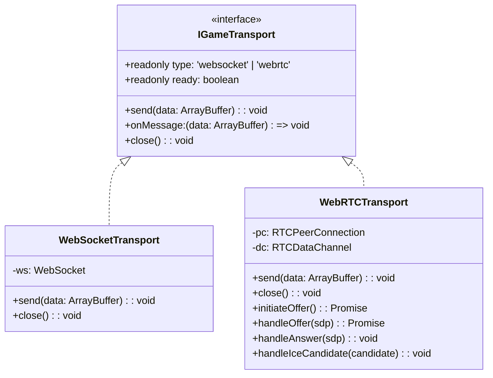
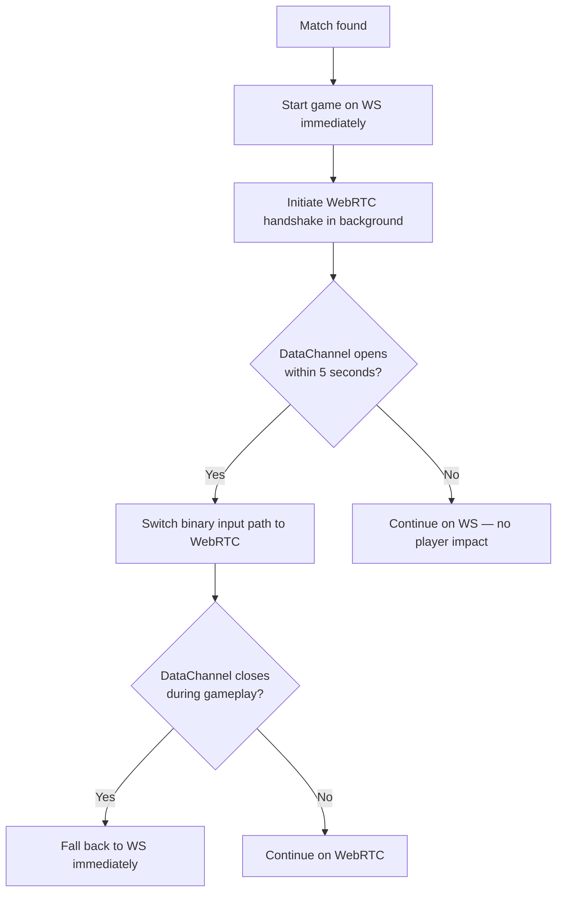

# H4KKEN — WebRTC Migration Technical Design

> **Purpose**: Technical specification for adding WebRTC DataChannel as preferred transport alongside existing WebSocket.

## Overview

WebRTC DataChannels provide UDP-like semantics (`ordered: false, maxRetransmits: 0`) that eliminate TCP head-of-line blocking. For a fighting game with GGPO rollback netcode, lost packets are handled by the prediction system — they don't need retransmission.

## Signaling Protocol

WebRTC requires a signaling channel to exchange SDP offers/answers and ICE candidates. The existing WebSocket connection serves as this channel.

### New Server Message Types

```typescript
// Client → Server (relayed to opponent in same room)
{ type: 'rtc-offer', sdp: string }    // SDP offer from playerIndex=0
{ type: 'rtc-answer', sdp: string }   // SDP answer from playerIndex=1
{ type: 'rtc-ice', candidate: string } // ICE candidate (both players)
```

The server **does not process** SDP or ICE — it only relays messages between matched players.

### Handshake Flow



## DataChannel Configuration

```typescript
const dataChannel = peerConnection.createDataChannel('game', {
  ordered: false,       // No ordering guarantee (UDP semantics)
  maxRetransmits: 0,    // Never retransmit lost packets
});
dataChannel.binaryType = 'arraybuffer';
```

**Why these settings?**
- `ordered: false` — Prevents head-of-line blocking. Out-of-order packets are delivered immediately.
- `maxRetransmits: 0` — Lost packets are gone. The rollback system handles the missing frame via prediction.
- Combined: True fire-and-forget UDP semantics over SCTP.

## ICE Server Configuration

```typescript
const iceServers = [
  // Free STUN (NAT traversal for most connections)
  { urls: 'stun:stun.l.google.com:19302' },
  { urls: 'stun:stun1.l.google.com:19302' },
  // Self-hosted TURN (relay for symmetric NAT / corporate firewalls)
  {
    urls: 'turn:turn.yourdomain.com:443?transport=tcp',
    username: 'h4kken',
    credential: '<from-env>',
  },
];
```

### Why TURN is Needed

STUN alone works for ~80% of NAT configurations. The remaining ~20% (symmetric NAT, common on mobile carriers and corporate networks) require TURN relay. For Mexico ↔ Germany play:

| NAT Type | STUN | TURN |
|----------|------|------|
| Full Cone | ✅ | ✅ |
| Restricted Cone | ✅ | ✅ |
| Port Restricted | ✅ | ✅ |
| Symmetric | ❌ | ✅ |

## Transport Abstraction



## Fallback Strategy



**Key principle**: The game **never waits** for WebRTC. WS works from frame 1. WebRTC is an upgrade that happens transparently.

## What Stays on WebSocket

| Message | Why WS |
|---------|--------|
| `join`, `matched`, `waiting` | Pre-match, no DataChannel yet |
| `countdown`, `fight` | Server-driven state, needs reliability |
| `roundResult` | Must be reliably delivered (determines match outcome) |
| `ping`/`pong` | RTT measurement (works on either, but WS is always available) |
| `superActivated` | Rare event, needs reliability |
| `rtc-offer/answer/ice` | Signaling messages |

## What Moves to WebRTC DataChannel

| Message | Why DC |
|---------|--------|
| Binary `syncInput` (8 bytes) | Sent 60 times/sec, loss-tolerant (rollback handles it) |
